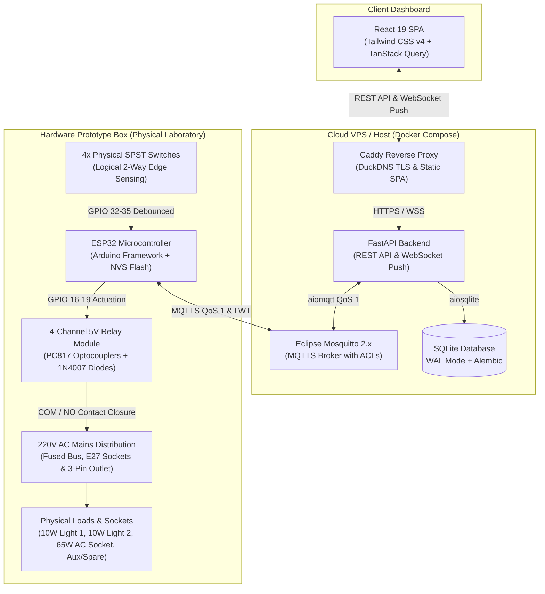
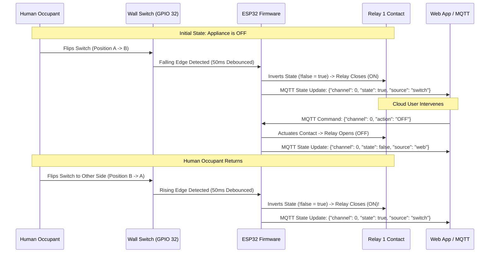
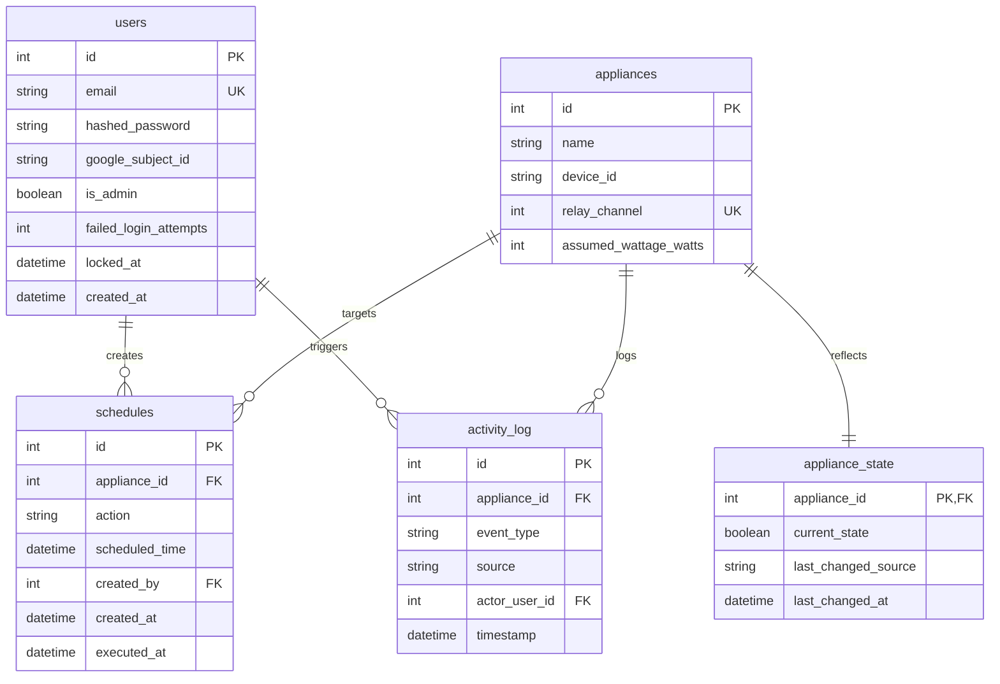
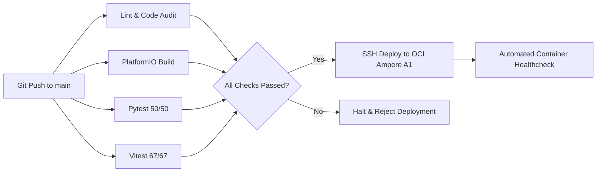

# Smart Office Appliance Control System (SAOCS)

> **An enterprise-grade, edge-resilient IoT platform for remote monitoring, scheduling, and two-way manual override of office appliances via MQTT, FastAPI, React, and ESP32 microcontrollers.**

[](https://github.com/saxrael/SAOCS/actions)
[](https://platformio.org/)
[](file:///backend/tests)
[](file:///frontend/src/test)
[](file:///scripts/audit_zero_comments.py)
[](file:///docs/Project_Summary.md)

---

## 📋 Table of Contents
- [System Architecture & Core Principles](#system-architecture--core-principles)
- [Key Features](#key-features)
- [Technology Stack](#technology-stack)
- [Repository Structure](#repository-structure)
- [Complete Hardware Engineering & Build Guide](#complete-hardware-engineering--build-guide)
  - [Hardware Bill of Materials (BOM)](#hardware-bill-of-materials-bom)
  - [Electrical Architecture & Dual-Rail Power Distribution](#electrical-architecture--dual-rail-power-distribution)
  - [Pinout & GPIO Contract](#pinout--gpio-contract)
  - [Relay Driver, Optocoupler Isolation & Flyback Protection](#relay-driver-optocoupler-isolation--flyback-protection)
  - [Input Pin Quirks & External Pull-Up Network](#input-pin-quirks--external-pull-up-network)
  - [220V AC Mains Distribution Schematic](#220v-ac-mains-distribution-schematic)
  - [Two-Way Logical Toggle Switch (XOR Edge Inversion)](#two-way-logical-toggle-switch-xor-edge-inversion)
  - [Step-by-Step Hardware Assembly Runbook](#step-by-step-hardware-assembly-runbook)
  - [Hardware Commissioning & Cold-Smoke Multimeter Protocol](#hardware-commissioning--cold-smoke-multimeter-protocol)
- [Firmware Architecture & Flashing Guide](#firmware-architecture--flashing-guide)
- [Database & Schema](#database--schema)
- [Environment Configuration & Secrets](#environment-configuration--secrets)
- [Local Quick Start & Verification](#local-quick-start--verification)
- [Automated Testing & Pre-Flight Audits](#automated-testing--pre-flight-audits)
- [CI/CD & Deployment Guide](#cicd--deployment-guide)
- [Security & Compliance Red-Lines](#security--compliance-red-lines)
- [Academic Defense Attribution](#academic-defense-attribution)

---

## 🏗️ System Architecture & Core Principles

SAOCS is engineered around a **single-source-of-truth, edge-resilient architecture**. The ESP32 edge microcontroller maintains authoritative physical state over connected appliances through Non-Volatile Storage (NVS flash), ensuring continuous autonomous operation and instantaneous manual switching even during complete Wi-Fi or cloud outages.



### Core Operating Principles
1. **Edge Autonomy (PRD FR-20)**: The ESP32 controls relays and processes switch inputs in a dedicated non-blocking loop independent of network status.
2. **Most-Recent-Change-Wins Arbitration (TRD §6)**: Physical switch inputs and MQTT commands converge on a single authoritative state variable inside the ESP32 main loop without requiring distributed clock synchronization.
3. **Hardware Contact Protection (PRD NFR-5)**: A non-blocking 1000ms cooldown queue strictly enforces contact switching intervals to prevent contact welding and relay coil overheating.
4. **Cold-Boot NVS State Restoration**: Upon power brownout recovery, relay states are read from ESP32 flash (`nvs`) and applied to physical outputs within 50ms before initiating Wi-Fi negotiation.

---

## ⚡ Key Features

* **Multi-Channel Appliance Control**: Independent actuation of 4 distinct office appliance channels (Lighting, Ventilation, Computing, Pumping).
* **Logical Two-Way (XOR) Switching**: Physical wall switches toggle appliance states on every flip (rising or falling edge) regardless of previous web dashboard commands.
* **Real-Time WebSocket Synchronization**: Sub-second UI updates pushed immediately upon physical actuation or cloud commands.
* **Audit-Grade Forensic Logging**: Every state transition is recorded in SQLite with event type (`POWER_ON`/`POWER_OFF`), origin (`switch`, `web`, `schedule`), and actor ID.
* **Energy & Financial Analytics**: Real-time energy consumption (kWh) and billing estimates based on Kaduna Electric Band A tariff (₦209.5/kWh).
* **Automated Scheduling Engine**: In-process background scheduler for time-based appliance activation and cutoff.
* **Enterprise Security**: Google OAuth2 + password fallback, bcrypt hashing, JWT access/refresh rotation, Mosquitto per-device ACL isolation, and account lockout protection.

---

## 🛠️ Technology Stack

| Layer | Technology | Version | Purpose |
| :--- | :--- | :--- | :--- |
| **Microcontroller** | ESP32-WROOM-32 Dev Module | Xtensa Dual-Core 240MHz | Edge appliance controller |
| **Firmware Framework** | PlatformIO / Arduino C++ | Core 6.1.19 / Espressif32 7.1.1 | Edge firmware execution |
| **Edge Libraries** | ArduinoJson, espMqttClient, Preferences, ArduinoOTA | Latest | JSON parsing, MQTTS client, flash NVS, OTA |
| **Backend Framework** | Python / FastAPI / Uvicorn | Python 3.12+ | Async REST API & WebSocket service |
| **Database & ORM** | SQLite WAL / SQLAlchemy / Alembic | Async SQLAlchemy 2.0 | Persistent relational datastore & migrations |
| **Message Broker** | Eclipse Mosquitto | 2.0.x | TLS-encrypted MQTT broker with ACLs |
| **Frontend SPA** | React / TypeScript / Vite | React 19, TS 5.6, Vite 6 | Responsive web application |
| **State & Styling** | TanStack Query v5 / Tailwind CSS | v5.60 / v4.0 | Real-time cache sync & CSS design system |
| **Edge Simulation** | Python aiohttp + aiomqtt | Custom | Headless Virtual ESP32 device emulator |
| **Reverse Proxy** | Caddy Server | Custom (`caddy-dns/duckdns`) | Automated Let's Encrypt DNS-01 TLS termination |
| **Containerization** | Docker / Docker Compose | Compose Specification | Containerized deployment |

---

## 📁 Repository Structure

```
SAOCS/
├── backend/                        # FastAPI REST API, WebSocket service, and database models
│   ├── app/
│   │   ├── api/                    # API route endpoints (auth, appliances, schedule, logs)
│   │   ├── models/                 # SQLAlchemy ORM models (User, Appliance, ActivityLog, etc.)
│   │   ├── schemas/                # Pydantic v2 validation schemas
│   │   ├── services/               # MQTT client service, WebSocket connection manager, scheduler
│   │   ├── config.py               # Pydantic application settings
│   │   ├── database.py             # Async engine and session factory
│   │   └── main.py                 # FastAPI lifespan application entry point
│   ├── migrations/                 # Alembic database migration revisions
│   ├── tests/                      # Pytest suite (unit, API, concurrency, security)
│   ├── Dockerfile                  # Multi-stage non-root container build
│   └── pyproject.toml              # Backend dependency declarations (uv-managed)
├── caddy/                          # Caddy reverse proxy configuration & custom Dockerfile
│   ├── Caddyfile                   # DuckDNS DNS-01 ACME TLS and reverse proxy rules
│   └── Dockerfile                  # Custom xcaddy build with caddy-dns/duckdns
├── docs/                           # Architectural, requirements, and defense specifications
│   ├── CICD_Documentation.md       # Pipeline architecture and automated deployment
│   ├── Defense_Demo_Choreography.md# 6-sequence live academic demonstration runbook
│   ├── Execution_Strategy_Handbook.md # Development handbook and engineering reasoning
│   ├── Hardware_Build_Guide.md     # Physical prototype fabrication & wiring guide
│   ├── Hardware_Preflight_Checklist.md# Physical prototype bench test checklist
│   ├── PRD.md                      # Product Requirements Document
│   ├── Project_Summary.md          # Capstone project context and governance
│   ├── Security_Documentation.md   # Security boundaries, ACLs, and NDPA compliance
│   ├── TRD.md                      # Technical Requirements Document
│   ├── UIUX_Documentation.md       # Frontend design system and accessibility specs
│   └── Viva_Voce_Defense_Guide.md  # 18-question comprehensive academic viva defense guide
├── firmware/                       # PlatformIO embedded C/C++ firmware project
│   ├── include/
│   │   └── config.h                # GPIO pin contracts, timings, and network constants
│   ├── src/
│   │   ├── main.cpp                # Main setup and loop orchestrator
│   │   ├── mqtt_client.cpp         # espMqttClient wrapper, state publisher, command subscriber
│   │   ├── ota.cpp                 # ArduinoOTA authenticated wireless updater
│   │   ├── relays.cpp              # Relay driver, 1000ms cooldown queue, and state arbiter
│   │   ├── serial_harness.cpp      # Bounded serial test and CLI harness
│   │   ├── storage.cpp             # Preferences NVS flash persistence driver
│   │   ├── switches.cpp            # 50ms debounced input scanner with edge detection
│   │   └── wifi_manager.cpp        # Non-blocking Wi-Fi reconnection manager
│   ├── test/                       # Python & PowerShell challenger verification test suites
│   └── platformio.ini              # PlatformIO environments (esp32dev, esp32dev_mqtt, esp32dev_release)
├── frontend/                       # React 19 + TypeScript web application
│   ├── src/
│   │   ├── api/                    # Typed API client, authentication interceptors, token refresh
│   │   ├── components/             # Accessible UI components (ApplianceCard, Header, Navbar)
│   │   ├── contexts/               # AuthContext, WebSocketContext
│   │   ├── pages/                  # Dashboard, Login, Schedules, ActivityLog, ManageUsers
│   │   └── test/                   # Vitest unit and integration tests
│   ├── package.json                # Frontend scripts and pinned dependencies
│   └── vite.config.ts              # Vite bundler configuration with Tailwind CSS v4 plugin
├── mosquitto/                      # Mosquitto message broker configuration
│   ├── acl/acl.conf                # Per-device topic isolation ACLs
│   └── config/mosquitto.conf       # Listener ports (1883 internal, 8883 MQTTS TLS)
├── presentation/                   # Academic defense deliverables
│   └── defense_deck.pptx           # 14-slide defense slide deck with speaker notes
├── scripts/                        # Operational, testing, and deployment scripts
│   ├── audit_zero_comments.py      # Strict Zero-Comments Rule AST verification scanner
│   ├── run_e2e_tests.py            # End-to-end test orchestrator
│   └── virtual_esp32.py            # Headless Virtual ESP32 Device Emulator with HTTP control API
├── tests/e2e/                      # Playwright E2E and hardware failure-branch test suites
├── docker-compose.yml              # Production multi-container orchestration
├── .env.template                   # Reference environment configuration
└── AGENTS.md                       # Project governance, source-of-truth hierarchy, and hard rules
```

---

## 🔌 Complete Hardware Engineering & Build Guide

> **For the full, step-by-step engineering and fabrication manual with wiring diagrams, multimeter commissioning protocols, and safety checklists, see [`docs/Hardware_Build_Guide.md`](file:///docs/Hardware_Build_Guide.md).**

### Hardware Bill of Materials (BOM)

| Item | Component | Specification / Model | Qty | Function |
| :---: | :--- | :--- | :---: | :--- |
| **1** | Microcontroller Module | ESP32-WROOM-32 (30-pin or 38-pin DevKit V1) | 1 | Edge processor, Wi-Fi radio, GPIO control |
| **2** | Relay Board Module | 4-Channel 5V Relay Board with PC817 Optocouplers (Songle SRD-05VDC-SL-C) | 1 | 250V AC / 10A galvanic switching |
| **3** | Power Supply | 5V DC / 2A Regulated Switching Power Supply (or Hi-Link HLK-PM01 AC-DC module) | 1 | Low-voltage DC system power |
| **4** | Ceiling Lamp Sockets | E27 Batten Ceramic / Bakelite Lamp Sockets | 2 | Physical fixtures for 10W ceiling bulbs (Channels 1 & 2) |
| **5** | LED Bulbs | 10W 220V AC E27 LED Bulbs (Warm / Daylight White) | 2 | Physical lighting loads for Channels 1 and 2 |
| **6** | AC Wall Socket | Single-Gang 3-Pin Switched Socket (UK BS 1363 Type G, 250V 13A) | 1 | Workstation utility socket for Channel 3 |
| **7** | Wall Toggle Switches | Single-Pole Single-Throw (SPST) Toggle or Rocker Switches (250V / 6A rated) | 4 | Manual appliance override controls |
| **8** | Master AC Power Switch | Double-Pole Single-Throw (DPST) Rocker Switch with indicator | 1 | Prototype emergency mains isolation |
| **9** | AC Fuse & Holder | 5A 250V AC Fast-Blow Glass Fuse + 5x20mm Panel-Mount Fuse Holder | 1 | Overcurrent fault protection |
| **10** | External Pull-Up Resistors | 10kΩ 1/4W 5% Metal Film / Carbon Film Resistors | 2 | Pull-up network for input-only GPIO 34 and 35 |
| **11** | Flyback Diodes | 1N4007 1000V 1A Silicon Rectifier Diodes | 4 | Coil back-EMF clamping (onboard or external) |
| **12** | Terminal Blocks | 12-Position Dual-Row 600V 15A Screw Terminal Strip | 2 | Mains AC Live, Neutral, and Earth distribution |
| **13** | Hookup Wire | 18 AWG Stranded Copper Wire (AC Mains: Brown/Blue/Green-Yellow)<br/>22–24 AWG Solid Copper Wire (DC Logic: Red/Black/Yellow/Blue) | As needed | High-voltage and low-voltage interconnects |
| **14** | Enclosure Box | ABS Flame-Retardant Electronics Project Box (approx. 250 x 190 x 90 mm) | 1 | Physical safety and isolation containment |
| **15** | Cable Glands | M16 or PG9 Nylon Cable Glands | 2 | AC mains power cord strain relief |

---

### Electrical Architecture & Dual-Rail Power Distribution

The prototype implements a **dual-rail electrical power architecture** to isolate inductive relay coil switching noise and voltage dips from the ESP32's 3.3V sensitive logic core:

```
              ┌─────────────────────────────────────────────────────────────┐
              │                DUAL-RAIL POWER DISTRIBUTION                 │
              └─────────────────────────────────────────────────────────────┘

    220V AC Live ─────[ Master DPST Switch ]─────[ 5A Fuse ]────┬───> To AC-DC 5V Supply
    220V AC Neutral ──[ Master DPST Switch ]────────────────────┼───> To AC-DC 5V Supply
    220V AC Earth ──────────────────────────────────────────────┼───> To 3-Pin Socket Earth
                                                                │
                                              ┌─────────────────┴───────────────┐
                                              │  5V DC / 2A Power Supply        │
                                              │  (Regulated Switching Source)   │
                                              └────────┬────────────────┬───────┘
                                                       │ +5V DC         │ 0V GND
                                                       ▼                ▼
     ┌───────────────────────────────────────────────────────────────────────────────┐
     │ +5V DC COIL RAIL (Red Bus)  ──> Connects to Relay Board JD-VCC                │
     │ COMMON GROUND BUS (Black Bus)──> Connects to ESP32 GND, Relay GND, Switch GND │
     └───────────────────────────────────────────────────────────────────────────────┘
                                                       │
                                                       ▼
                                              ┌─────────────────┐
                                              │ ESP32 VIN / 5V  │
                                              │ (Onboard LDO)   │
                                              └────────┬────────┘
                                                       │ +3.3V DC Out
                                                       ▼
     ┌───────────────────────────────────────────────────────────────────────────────┐
     │ +3.3V DC LOGIC RAIL (Orange Bus)                                              │
     │ ├──> Connects to Relay Board VCC (Optocoupler Anodes)                         │
     │ └──> Connects to 10kΩ External Pull-Up Resistors for GPIO 34 & 35             │
     └───────────────────────────────────────────────────────────────────────────────┘
```

---

### Pinout & GPIO Contract

The GPIO pin assignment table is a **strict hardware-firmware contract** (TRD §6). It is locked across physical wiring, firmware source code, and emulation scripts:

| Logical Channel | Function | ESP32 GPIO | Electrical Mode | Target Appliance / Physical Load |
| :---: | :---: | :---: | :--- | :--- |
| **Channel 1** | Relay Actuation Output | **GPIO 16** | Digital Output (Active-HIGH) | 10W Ceiling Light 1 (E27 Lamp Socket) |
| **Channel 2** | Relay Actuation Output | **GPIO 17** | Digital Output (Active-HIGH) | 10W Ceiling Light 2 (E27 Lamp Socket) |
| **Channel 3** | Relay Actuation Output | **GPIO 18** | Digital Output (Active-HIGH) | Workstation Socket (Standard 3-Pin AC Socket, 65W) |
| **Channel 4** | Relay Actuation Output | **GPIO 19** | Digital Output (Active-HIGH) | Auxiliary / Spare (Relay 4 Screw Terminal, 0W) |
| **Channel 1** | Physical Switch Input | **GPIO 32** | Digital Input (Internal `INPUT_PULLUP`) | Ceiling Light 1 Manual Toggle |
| **Channel 2** | Physical Switch Input | **GPIO 33** | Digital Input (Internal `INPUT_PULLUP`) | Ceiling Light 2 Manual Toggle |
| **Channel 3** | Physical Switch Input | **GPIO 34** | Digital Input (`INPUT` + External 10kΩ Pull-Up) | Workstation Socket Manual Toggle |
| **Channel 4** | Physical Switch Input | **GPIO 35** | Digital Input (`INPUT` + External 10kΩ Pull-Up) | Auxiliary / Spare Manual Toggle |

---

### Relay Driver, Optocoupler Isolation & Flyback Protection

Commercial 4-channel relay modules use **PC817 optocouplers** to provide galvanic isolation between the microcontroller and the relay coils:

1. **Optocoupler Power Jumper (`VCC-JDVCC`)**:
   * **Crucial Step**: Remove the factory-installed yellow jumper shunt bridging `VCC` and `JD-VCC`.
   * Connect `JD-VCC` directly to the **+5V DC Power Supply Rail**. This supplies coil actuation current (~70mA per energized relay) without drawing from the ESP32.
   * Connect `VCC` on the logic header to the **ESP32 +3.3V pin**. This powers the optocoupler internal infrared LEDs at 3.3V.
   * Connect `GND` to the **Common Ground Bus**.
2. **Logic Trigger Polarity**:
   * Firmware drives output pins using Active-HIGH logic: `digitalWrite(RELAY_PINS[channel], HIGH)` to close contacts.
   * If using an Active-LOW relay module, invert the logic flag in firmware or install NPN driver transistors (2N2222) with base resistors.
3. **Inductive Kickback Protection**:
   * Reverse-biased 1N4007 flyback diodes are installed across each relay coil (`Cathode` to +5V, `Anode` to ground/driver collector) to safely suppress inductive voltage spikes upon de-energization.

---

### Input Pin Quirks & External Pull-Up Network

The ESP32 silicon has specific hardware constraints on higher GPIOs:
* **GPIO 32 and 33**: Bidirectional GPIOs equipped with internal software-configurable pull-up and pull-down resistors (~45kΩ). In firmware, they are initialized via `pinMode(pin, INPUT_PULLUP)`.
* **GPIO 34 and 35**: **Input-only pins (GPI)** lacking internal pull-up or pull-down resistors in the ESP32 hardware.
* **External Pull-Up Wiring**:
  * Connect a **10kΩ resistor** between `GPIO 34` and the **+3.3V Logic Rail**.
  * Connect a second **10kΩ resistor** between `GPIO 35` and the **+3.3V Logic Rail**.
  * Wire the physical switches between the GPIO pin and the **Common Ground Bus (GND)**.
  * When the switch is open, the pin is pulled securely to 3.3V (`HIGH`). When the switch is closed, the pin is pulled to GND (`LOW`).

---

### 220V AC Mains Distribution Schematic

> [!WARNING]
> High-voltage AC electricity presents severe risk of electric shock and fire. Disconnect master mains power before inspecting wiring. All high-voltage conductors must be fully insulated with heat-shrink tubing.

```
       220V AC Mains Input (Plug)
       ├── Live (L) ────[ Master DPST Switch ]────[ 5A Fuse ]────┬───> AC-DC 5V Supply (L)
       │                                                         │
       │                                                         ├───> Relay 1 COM ──[NO]──> Bulb 1 (L)
       │                                                         ├───> Relay 2 COM ──[NO]──> Bulb 2 (L)
       │                                                         ├───> Relay 3 COM ──[NO]──> Bulb 3 (L)
       │                                                         └───> Relay 4 COM ──[NO]──> Bulb 4 (L)
       │
       └── Neutral (N) ─[ Master DPST Switch ]───────────────────┬───> AC-DC 5V Supply (N)
                                                                 │
                                                                 ├───> Bulb 1 Neutral (N)
                                                                 ├───> Bulb 2 Neutral (N)
                                                                 ├───> Bulb 3 Neutral (N)
                                                                 └───> Bulb 4 Neutral (N)
```

* **Relay Terminals Used**: Connect AC Live to the relay **COM (Common)** terminal. Connect the appliance load to the relay **NO (Normally Open)** terminal. When de-energized, the circuit is broken, ensuring zero idle power to the appliance.

---

### Two-Way Logical Toggle Switch (XOR Edge Inversion)

SAOCS employs **Logical 2-Way Switching**:



#### Firmware Implementation ([firmware/src/main.cpp](file:///firmware/src/main.cpp))
```cpp
Switches::tick([](uint8_t channel, bool) {
    Relays::setCurrentSource("switch");
    bool targetState = !Relays::getState(channel);
    Relays::requestStateChange(channel, targetState);
});
```

---

### Step-by-Step Hardware Assembly Runbook

1. **Step 1: Enclosure Preparation**  
   Drill mounting holes in the ABS enclosure for 4 E27 lamp holders, 4 toggle switches, 1 master DPST switch, and 2 cable glands. Install nylon standoffs for the ESP32 and relay boards.
2. **Step 2: Low-Voltage DC Bus Assembly**  
   Mount the ESP32 and 4-channel relay board. Wire the Common Ground Bus tying ESP32 GND, Relay GND, and DC Power Supply GND together.
3. **Step 3: Pull-Up Network & Switch Wiring**  
   Solder 10kΩ pull-up resistors from +3.3V to GPIO 34 and GPIO 35. Connect one terminal of each SPST switch to GPIO 32, 33, 34, 35 respectively, and the opposing terminal to the Common Ground Bus.
4. **Step 4: Relay Control Interconnects**  
   Connect ESP32 GPIO 16, 17, 18, 19 to relay input pins IN1, IN2, IN3, IN4. Connect the 5V power supply output to relay `JD-VCC`, and ESP32 3.3V to relay `VCC` with the jumper removed.
5. **Step 5: High-Voltage AC Mains Wiring**  
   Pass the AC power cord through the strain-relief cable gland. Route Live through the Master DPST switch and 5A fuse. Daisy-chain Live into relay COM terminals 1–4. Connect each NO terminal to the center contact of each E27 socket. Connect Neutral to the threaded outer contact of each E27 socket. Insulate all AC joints with dual-wall heat-shrink tubing.

---

### Hardware Commissioning & Cold-Smoke Multimeter Protocol

Execute these verification checks before connecting 220V AC mains power:

* [ ] **Continuity Check (DMM Ohms mode)**:
  * Probe between AC Live and AC Neutral with the master switch ON and all relays OFF. Resistance must be **infinite ($\infty$)**. Zero ohms indicates a dead short.
  * Probe between AC Live and DC Common Ground. Resistance must be **infinite ($\infty$)** (proving total galvanic isolation).
* [ ] **Low-Voltage DC Verification**:
  * Power only the 5V DC supply (with mains isolated from relay contacts).
  * Measure voltage across ESP32 VIN and GND: Must read **$5.0\text{V} \pm 0.2\text{V}$**.
  * Measure voltage across ESP32 3V3 pin and GND: Must read **$3.3\text{V} \pm 0.1\text{V}$**.
  * Measure GPIO 34 and 35: Must read **$3.3\text{V}$** (confirming 10kΩ pull-up integrity).
* [ ] **Cold Actuation Click Test**:
  * Flash firmware. Flip physical switches 1–4 one by one. Confirm distinct, crisp audible mechanical clicks from each relay.
* [ ] **Live Mains Load Test**:
  * Insert 4 LED test bulbs into the sockets. Connect AC mains power cord. Flip Master Switch ON.
  * Verify each channel turns ON and OFF reliably via physical switch flips and web commands.

---

## ⚡ Firmware Architecture & Flashing Guide

The firmware is compiled via **PlatformIO Core** using the Arduino framework for ESP32.

### PlatformIO Environments ([firmware/platformio.ini](file:///firmware/platformio.ini))
* `esp32dev`: Local serial-only bench testing (no Wi-Fi/MQTT dependencies, serial harness enabled).
* `esp32dev_mqtt`: Full prototype build with Wi-Fi, MQTTS client, NVS persistence, and serial harness.
* `esp32dev_release`: Production firmware (serial debugging disabled for maximum execution speed).

### USB-UART Driver Setup
Ensure the appropriate USB-UART bridge VCP driver is installed on your host system:
* **Silicon Labs CP2102**: Standard NodeMCU / ESP32 boards.
* **WCH CH340G / CH341**: Common clone ESP32 boards.

### Compilation & Flashing Commands

```bash
# Navigate to firmware directory
cd firmware

# Compile and flash prototype firmware via USB serial
pio run -e esp32dev_mqtt -t upload

# Open serial debug monitor at 115200 baud
pio device monitor -b 115200

# Compile release build without serial harness
pio run -e esp32dev_release
```

### Over-The-Air (OTA) Updates
Once deployed inside the sealed prototype enclosure, firmware can be updated wirelessly over Wi-Fi without opening the box:

```bash
pio run -e esp32dev_release -t upload --upload-port <ESP32_HOTSPOT_IP> --upload-flags "--auth=${OTA_PASSWORD}"
```

---

## 🛢️ Database & Schema

All persistent data is managed by the FastAPI backend using **SQLite in Write-Ahead Logging (WAL) mode** via async SQLAlchemy (`aiosqlite`). Schema migrations are version-controlled with Alembic.



### Alembic Migrations
* `001_initial_schema`: Establishes the 5 relational tables, unique constraints, foreign keys, and indexes.
* `002_seed_admin_user`: Seeds the initial administrator account (`israelanuoluwaposimi955@gmail.com`).

---

## 🔑 Environment Configuration & Secrets

All configuration is managed through environment variables. Copy `.env.template` to `.env` and populate secrets:

```bash
cp .env.template .env
```

| Variable | Description | Default / Example |
| :--- | :--- | :--- |
| `ENVIRONMENT` | Runtime environment (`development` / `production`) | `development` |
| `DATABASE_URL` | SQLite async database connection string | `sqlite:///./data/saocs.db` |
| `JWT_SECRET_KEY` | 64-character cryptographic key for token signing | *(Must be generated)* |
| `GOOGLE_CLIENT_ID` | Google OAuth2 Client ID | `your-client-id.apps.googleusercontent.com` |
| `GOOGLE_CLIENT_SECRET` | Google OAuth2 Client Secret | `your-google-secret` |
| `WIFI_SSID` | 2.4 GHz Wi-Fi / Personal Hotspot SSID | `SAOCS_HOTSPOT` |
| `WIFI_PASSWORD` | Wi-Fi / Personal Hotspot WPA2 Passphrase | `securepassword` |
| `MQTT_BROKER_HOST` | MQTT broker IP or container hostname | `mosquitto` (or OCI static IP) |
| `MQTT_TLS_PORT` | MQTTS encrypted listener port | `8883` |
| `MQTT_DEVICE_USER` | ESP32 device MQTT username | `saocs_esp32` |
| `MQTT_DEVICE_PASSWORD` | ESP32 device MQTT password | *(Must be generated)* |
| `MQTT_BACKEND_USER` | Backend MQTT username | `saocs_backend` |
| `MQTT_BACKEND_PASSWORD`| Backend MQTT password | *(Must be generated)* |
| `TARIFF_RATE_PER_KWH` | Kaduna Electric Band A tariff rate in Naira | `209.5` |
| `DUCKDNS_DOMAIN` | DuckDNS domain for dynamic DNS and ACME TLS | `smart-office-abu.duckdns.org` |
| `DUCKDNS_TOKEN` | DuckDNS account token | *(Generated at duckdns.org)* |

---

## 🚀 Local Quick Start & Verification

### Option A: Complete Docker Compose Stack (Recommended)
Spins up Caddy, FastAPI, Mosquitto, and DuckDNS with a single command:

```bash
# 1. Clone repository
git clone https://github.com/saxrael/SAOCS.git
cd SAOCS

# 2. Configure environment
cp .env.template .env
# Edit .env with your secrets

# 3. Launch container stack
docker compose up --build -d

# 4. Inspect container health status
docker compose ps
```
Access the application at `http://localhost` (or `https://your-domain.duckdns.org`).

---

### Option B: Local Development Setup (Manual)

#### 1. Backend Service
```bash
cd backend
# Install dependencies using uv
uv sync

# Run database schema migrations
uv run alembic upgrade head

# Start FastAPI development server
uv run uvicorn app.main:app --host 0.0.0.0 --port 8000 --reload
```

#### 2. Frontend Application
```bash
cd frontend
# Install Node dependencies
npm install

# Launch Vite development server
npm run dev
```
Dashboard will be live at `http://localhost:5173`.

#### 3. Headless Virtual ESP32 Device Emulator
If physical ESP32 hardware is not connected, run the Python-based virtual device emulator:

```bash
# Launches virtual ESP32 with simulated NVS persistence and 1000ms debounce queue
python scripts/virtual_esp32.py
```
The emulator connects to Mosquitto and exposes an HTTP simulation API on port `8099` (e.g. `POST http://localhost:8099/api/switches/1/toggle`).

---

## 🧪 Automated Testing & Pre-Flight Audits

The codebase enforces strict test coverage and static analysis across all layers:

```bash
# 1. Backend Pytest Suite (50 tests covering auth, endpoints, concurrency, and NVS)
cd backend && uv run pytest -v

# 2. Frontend Vitest Suite (67 tests covering components, WebSocket sync, and energy)
cd frontend && npm test

# 3. PlatformIO Firmware Multi-Target Compilation (esp32dev, esp32dev_mqtt, esp32dev_release)
pio run -d firmware

# 4. Strict Zero-Comments Rule AST Audit
python scripts/audit_zero_comments.py

# 5. Full End-to-End Orchestrator Suite
python scripts/run_e2e_tests.py
```

---

## 🚢 CI/CD & Deployment Guide

SAOCS utilizes a **GitHub Actions CI/CD pipeline** (`.github/workflows/deploy.yml`) with automated testing gates and secure OCI deployment:



### Production Host Requirements
* **Oracle Cloud Infrastructure (OCI)**: Ampere A1 Compute Instance (Always-Free 4 OCPU, 24 GB RAM).
* **Ports Opened**: `80/tcp` (HTTP ACME redirect), `443/tcp` (HTTPS Caddy), `8883/tcp` (MQTTS TLS).

---

## 🔒 Security & Compliance Red-Lines

> [!CAUTION]
> The following security rules are absolute and enforced across all automated workflows:
> 
> 1. **Never Commit Secrets**: No secrets, tokens, or live credentials may ever be committed to source control.
> 2. **Never Touch `.env` in Code**: Automated scripts and assistants must maintain `.env.template` only.
> 3. **Strict Zero-Comments Rule**: All code, configuration, and scripts must contain zero comments of any kind (no inline comments, ASCII headers, or dividers) except required framework API docstrings.
> 4. **Fixed GPIO Contract**: The GPIO pin mapping (`16-19` for Relays, `32-35` for Switches) is locked to physical hardware wiring.
> 5. **Contact Debounce**: The 1000ms contact protection debounce window must never be bypassed.
> 6. **Account Lockout**: 5 consecutive failed login attempts trigger an immediate 15-minute account lockout.
> 7. **Broker Isolation**: The ESP32 is restricted via Mosquitto ACLs to its own device topics (`office/esp32_prototype_01/#`) and cannot publish to administrative or other device queues.

---

## 🎓 Academic Defense Attribution

* **Project Title**: Design and Implementation of a Smart Office Appliance Control System (SAOCS)
* **Candidate & Presenter**: Jesutoyin Adeshina (Matriculation Number: **U21CS1119**)
* **Institution**: Department of Computer Science, Faculty of Physical Sciences, Ahmadu Bello University, Zaria, Nigeria
* **Software & Firmware Lead**: Israel
* **Hardware & Fabrication Lead**: Abdulfatai
* **Tariff Baseline**: Kaduna Electric (KAEDC) Band A Cost Matrix (₦209.5 per kWh, July 2024 NERC Schedule)
